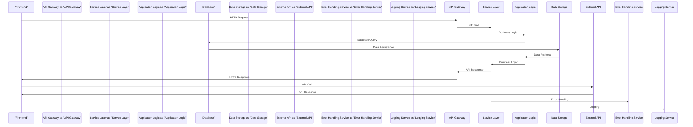

# System Architecture

## Architecture Overview

System Architecture Documentation
================================

## High-Level Overview

The system architecture is designed using a feature-based organization approach, with a focus on low coupling and high cohesion. The architectural style is currently unknown, but the design patterns used include the Service Layer Pattern. The system is divided into four main layers: Presentation Layer, Business Logic Layer, Data Access Layer, and Infrastructure Layer.

Key design principles include:

* Separation of Concerns (SoC): Each layer is responsible for a specific aspect of the system, ensuring that changes to one layer do not affect others.
* Loose Coupling: Components are designed to be independent, reducing the impact of changes to one component on others.
* High Cohesion: Components are designed to be self-contained, with related functionality grouped together.

The overall system approach is to provide a scalable, maintainable, and secure architecture that supports the requirements of the application.

## Architecture Diagram

```mermaid
graph TD
    subgraph Presentation Layer
        A[Frontend] -->|HTTP Requests|> B[Load Balancer]
        B -->|HTTP Requests|> C[Web Server]
        C -->|HTTP Requests|> D[API Gateway]
    end
    subgraph Business Logic Layer
        D -->|API Calls|> E[Service Layer]
        E -->|Business Logic|> F[Application Logic]
    end
    subgraph Data Access Layer
        F -->|Database Queries|> G[Database]
        G -->|Data Persistence|> H[Data Storage]
    end
    subgraph Infrastructure Layer
        H -->|Configuration Management|> I[Configuration Server]
        I -->|Environment Handling|> J[Environment Server]
    end
    D -->|External API Integration|> K[External API]
    E -->|Error Handling|> L[Error Handling Service]
    F -->|Logging|> M[Logging Service]
```

This diagram shows the high-level architecture of the system, including the relationships between the different layers and components.

## Core Components

### 1. Presentation Layer

* Frontend technologies and frameworks: The frontend is built using HTML, CSS, and JavaScript, with a framework such as React or Angular.
* UI component structure: The UI is composed of reusable components, each with its own set of responsibilities.
* Client-side state management: The frontend uses a state management library such as Redux or MobX to manage application state.
* User interaction patterns: The frontend handles user interactions, such as clicks and form submissions, and sends requests to the API Gateway.

### 2. Business Logic Layer

* Application logic organization: The application logic is organized into a service layer, which provides a interface for the presentation layer to interact with the business logic.
* Service layer architecture: The service layer is designed using the Service Layer Pattern, which provides a clear separation of concerns between the presentation layer and the business logic.
* Business rules implementation: The business rules are implemented in the application logic, using a rules engine or a custom implementation.
* Processing workflows: The application logic handles processing workflows, such as data validation and processing.

### 3. Data Access Layer

* Database integration patterns: The data access layer uses a database integration pattern, such as the Repository Pattern, to interact with the database.
* Data persistence strategies: The data access layer uses a data persistence strategy, such as caching or lazy loading, to improve performance.
* API design and implementation: The API is designed using a RESTful architecture, with clear and concise endpoints.
* Caching mechanisms: The data access layer uses caching mechanisms, such as Redis or Memcached, to improve performance.

### 4. Infrastructure Layer

* Configuration management: The infrastructure layer uses a configuration management tool, such as Ansible or Puppet, to manage configuration.
* Environment handling: The infrastructure layer uses an environment handling tool, such as Docker or Kubernetes, to manage environments.
* Build and deployment: The infrastructure layer uses a build and deployment tool, such as Jenkins or Travis CI, to manage builds and deployments.
* External integrations: The infrastructure layer handles external integrations, such as API calls to external services.

## Data Flow Architecture



This sequence diagram shows the data flow architecture of the system, including the interactions between the different components and layers.

## Component Breakdown

### 1. Frontend

* Purpose and responsibility: The frontend is responsible for handling user interactions and rendering the UI.
* Key files and directories: The frontend code is located in the `frontend` directory, with key files including `index.html`, `app.js`, and `components`.
* Dependencies and relationships: The frontend depends on the API Gateway and the External API.
* Performance considerations: The frontend should be optimized for performance, with techniques such as caching, minification, and compression.

### 2. API Gateway

* Purpose and responsibility: The API Gateway is responsible for handling API requests and routing them to the correct service.
* Key files and directories: The API Gateway code is located in the `api-gateway` directory, with key files including `app.js` and `routes`.
* Dependencies and relationships: The API Gateway depends on the Service Layer and the External API.
* Performance considerations: The API Gateway should be optimized for performance, with techniques such as caching, load balancing, and scaling.

### 3. Service Layer

* Purpose and responsibility: The Service Layer is responsible for providing a interface for the presentation layer to interact with the business logic.
* Key files and directories: The Service Layer code is located in the `service-layer` directory, with key files including `app.js` and `services`.
* Dependencies and relationships: The Service Layer depends on the Application Logic and the Database.
* Performance considerations: The Service Layer should be optimized for performance, with techniques such as caching, lazy loading, and scaling.

### 4. Application Logic

* Purpose and responsibility: The Application Logic is responsible for handling business logic and processing workflows.
* Key files and directories: The Application Logic code is located in the `application-logic` directory, with key files including `app.js` and `logic`.
* Dependencies and relationships: The Application Logic depends on the Database and the External API.
* Performance considerations: The Application Logic should be optimized for performance, with techniques such as caching, lazy loading, and scaling.

## Integration Patterns

* How components communicate: Components communicate using API calls, with the API Gateway routing requests to the correct service.
* API integration strategies: The API is designed using a RESTful architecture, with clear and concise endpoints.
* Event handling patterns: The system uses an event handling pattern, such as the Observer Pattern, to handle events and notifications.
* Error propagation: The system uses an error propagation pattern, such as the Error Handling Service, to handle errors and exceptions.

## Scalability Analysis

* Current architecture scalability: The current architecture is designed to scale horizontally, with techniques such as load balancing and scaling.
* Bottlenecks and limitations: The system has bottlenecks and limitations, such as database performance and network latency.
* Scaling strategies: The system can be scaled using techniques such as caching, lazy loading, and scaling.
* Performance considerations: The system should be optimized for performance, with techniques such as caching, minification, and compression.

## Security Architecture

* Authentication and authorization: The system uses an authentication and authorization mechanism, such as OAuth or JWT, to secure API requests.
* Data protection strategies: The system uses data protection strategies, such as encryption and access control, to protect sensitive data.
* Security boundaries: The system has security boundaries, such as firewalls and intrusion detection systems, to protect against external threats.
* Vulnerability considerations: The system should be designed to mitigate vulnerabilities, such as SQL injection and cross-site scripting (XSS).

## Dependency Analysis

### Graph Metrics
- **Total Modules**: 108
- **Dependencies**: 433
- **Graph Density**: 0.037
- **Connectivity**: Well Connected
- **Average Connections per Module**: 8.02

### Component Breakdown

#### Web Files
- **Count**: 105 files
- **Total Lines**: 5,386
- **Key Files**:
  - `src\data\data-bookings.js` (293 lines)
  - `src\data\data-guests.js` (217 lines)
  - `src\styles\index.css` (196 lines)
  - `src\styles\globalStyles.js` (191 lines)
  - `src\features\bookings\BookingDataBox.jsx` (187 lines)

#### Config Files
- **Count**: 2 files
- **Total Lines**: 6,485
- **Key Files**:
  - `package-lock.json` (6448 lines)
  - `package.json` (37 lines)

#### Documentation Files
- **Count**: 1 files
- **Total Lines**: 8
- **Key Files**:
  - `README.md` (8 lines)


## Dependency Visualization

An interactive dependency graph has been generated showing the relationships between modules.

*View the dependency graph: [dependency_graph.html](../dependency_graph.html)*

## Integration Patterns

Based on the analysis, the system follows these integration patterns:

## Technical Layers

### Presentation Layer
- User interface components
- Web pages and forms
- Client-side scripting

### Business Logic Layer  
- Application logic and workflows
- Data processing and validation
- Business rules implementation

### Data Access Layer
- Database connections and queries
- Data persistence and retrieval
- Transaction management

---

[← Back to Overview](./index.md) | [Database Documentation →](./database.md)
