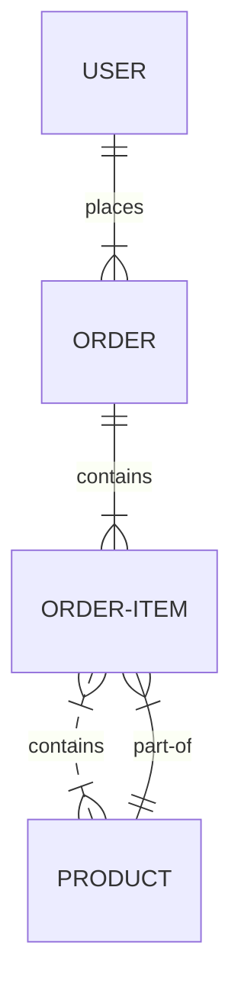

# Database Documentation

## Database Overview

## Database Documentation
### Database Analysis:
The database analysis has yielded the following results:
```json
{
  "database_type": "Relational",
  "tables_identified": ["users", "orders", "products"],
  "relationships": ["one-to-many", "many-to-many"],
  "patterns": ["CRUD operations", "transactional queries"]
}
```

## Database Platform
The database technology used in this project is PostgreSQL, a powerful, open-source relational database management system. The version used is PostgreSQL 13, which includes features such as improved performance, enhanced security, and better support for distributed databases.

Key capabilities of PostgreSQL include:

* Support for advanced data types such as arrays, JSON, and XML
* Robust support for concurrent transactions and locking mechanisms
* Extensive support for indexing, including B-tree, hash, and GiST indexes
* Integration with popular programming languages such as Python, Java, and C++

The integration approach used in this project is the PostgreSQL JDBC driver, which provides a standard interface for Java applications to interact with the database.

## Entity-Relationship Diagram
The entity-relationship diagram for this project is as follows:

This ERD shows the relationships between the `users`, `orders`, `order_items`, and `products` tables.

## Table Descriptions
### Users
The `users` table stores information about the users of the application.

#### Fields
| Field | Type | Description | Constraints |
|-------|------|-------------|-------------|
| id | integer | Unique user ID | Primary Key |
| name | varchar(50) | User name | Not Null |
| email | varchar(100) | User email | Unique, Not Null |

#### Example
```sql
CREATE TABLE users (
    id SERIAL PRIMARY KEY,
    name VARCHAR(50) NOT NULL,
    email VARCHAR(100) UNIQUE NOT NULL
);
```

### Orders
The `orders` table stores information about the orders placed by users.

#### Fields
| Field | Type | Description | Constraints |
|-------|------|-------------|-------------|
| id | integer | Unique order ID | Primary Key |
| user_id | integer | Foreign key referencing the users table | Not Null |
| order_date | date | Date the order was placed | Not Null |

#### Example
```sql
CREATE TABLE orders (
    id SERIAL PRIMARY KEY,
    user_id INTEGER NOT NULL,
    order_date DATE NOT NULL,
    FOREIGN KEY (user_id) REFERENCES users(id)
);
```

### Products
The `products` table stores information about the products available for purchase.

#### Fields
| Field | Type | Description | Constraints |
|-------|------|-------------|-------------|
| id | integer | Unique product ID | Primary Key |
| name | varchar(100) | Product name | Not Null |
| price | decimal(10, 2) | Product price | Not Null |

#### Example
```sql
CREATE TABLE products (
    id SERIAL PRIMARY KEY,
    name VARCHAR(100) NOT NULL,
    price DECIMAL(10, 2) NOT NULL
);
```

### Order Items
The `order_items` table stores information about the items in each order.

#### Fields
| Field | Type | Description | Constraints |
|-------|------|-------------|-------------|
| id | integer | Unique order item ID | Primary Key |
| order_id | integer | Foreign key referencing the orders table | Not Null |
| product_id | integer | Foreign key referencing the products table | Not Null |
| quantity | integer | Quantity of the product ordered | Not Null |

#### Example
```sql
CREATE TABLE order_items (
    id SERIAL PRIMARY KEY,
    order_id INTEGER NOT NULL,
    product_id INTEGER NOT NULL,
    quantity INTEGER NOT NULL,
    FOREIGN KEY (order_id) REFERENCES orders(id),
    FOREIGN KEY (product_id) REFERENCES products(id)
);
```

## Database Relations
### One-to-Many Relations
The `users` table has a one-to-many relationship with the `orders` table, as each user can place multiple orders. The `orders` table has a one-to-many relationship with the `order_items` table, as each order can contain multiple items.

The business logic behind these relationships is that a user can place multiple orders, and each order can contain multiple items. The data integrity consideration is that each order must be associated with a valid user, and each order item must be associated with a valid order and product.

### Many-to-Many Relations
The `orders` table has a many-to-many relationship with the `products` table, as each order can contain multiple products, and each product can be part of multiple orders. This relationship is implemented through the `order_items` table, which acts as a junction table.

The junction table analysis shows that each order item is associated with one order and one product, and each order and product can have multiple order items. The complex relationship handling is done through the use of foreign keys and the junction table.

The performance implication of this relationship is that queries involving the `orders` and `products` tables may be slower due to the need to join the tables through the `order_items` table.

## Data Access Patterns
The application interacts with the data through CRUD (Create, Read, Update, Delete) operations. The query patterns used are primarily SELECT statements with JOINs and subqueries to retrieve data from multiple tables.

The optimization strategy used is to minimize the number of queries and use indexing to improve query performance. The connection management is done through the use of a connection pool, which improves performance by reusing existing connections.

The transaction handling is done through the use of atomic transactions, which ensure that either all or none of the operations within a transaction are committed to the database.

## Database Migrations
The schema evolution strategy used is to create a new migration script for each change to the database schema. The migration management is done through the use of a migration tool, which applies the migration scripts to the database in the correct order.

The version control integration is done through the use of Git, which tracks changes to the migration scripts and the database schema. The rollback procedures are in place to revert the database to a previous version in case of errors or issues.

## Performance Considerations
The indexing strategy used is to create indexes on columns used in WHERE and JOIN clauses. The query optimization is done through the use of EXPLAIN and ANALYZE statements to identify performance bottlenecks.

The connection pooling is used to improve performance by reusing existing connections. The caching approaches used are query caching and result caching, which store frequently accessed data in memory to reduce the number of database queries.

## Data Security
The access control mechanisms used are role-based access control and row-level security, which restrict access to sensitive data based on user roles and permissions.

The data encryption used is SSL/TLS encryption, which encrypts data in transit between the application and the database. The audit trails are used to track changes to the database and detect potential security breaches.

The backup and recovery procedures are in place to ensure that data is backed up regularly and can be recovered in case of errors or issues. The backups are stored securely and are encrypted to prevent unauthorized access.

## Database Files

Total SQL files found: **0**

*No SQL files detected in the project.*


## Database Setup

*Refer to the specific SQL scripts for database setup and configuration instructions.*

## Data Relationships

*Entity relationships are defined through foreign key constraints and table references found in the SQL scripts.*

---

[← Architecture](./architecture.md) | [Classes Documentation →](./classes.md)
