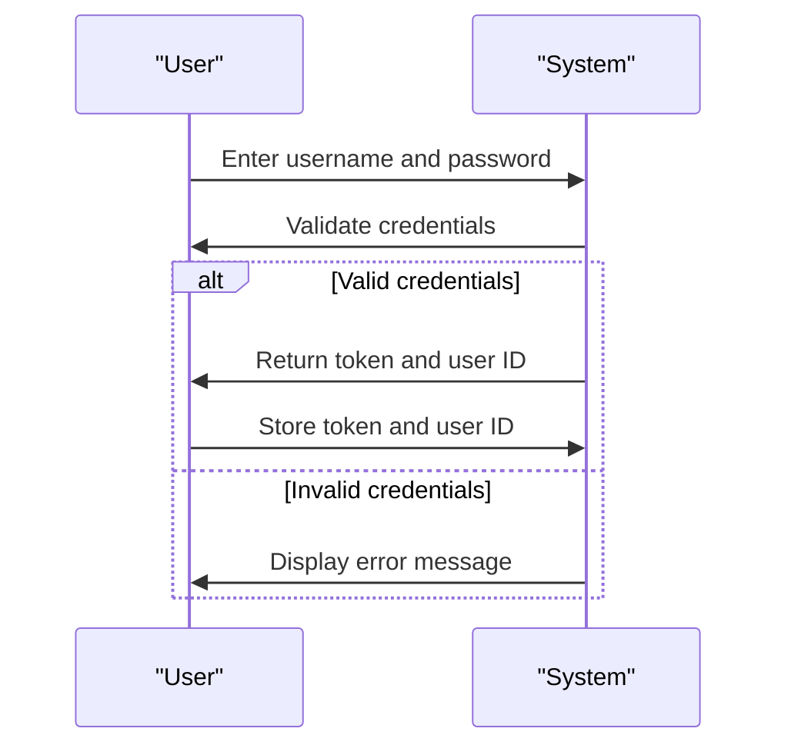
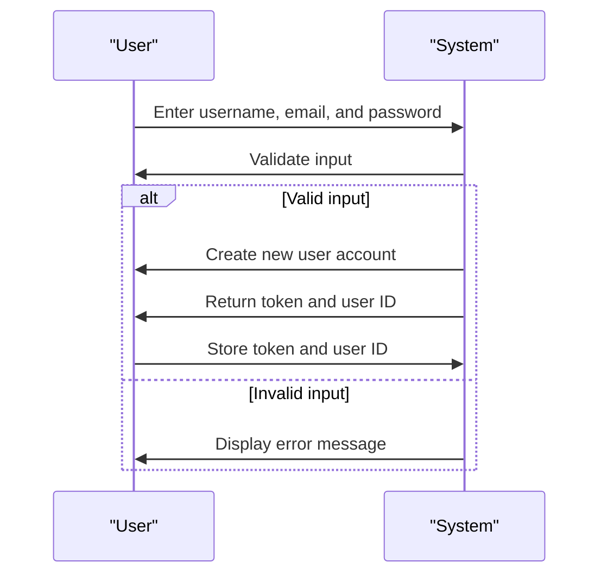

# Web Interface Documentation

## Web Overview

Web Interface Documentation
==========================

## Overview

The web interface of this project is built using a client-side routing pattern, with a total of 105 pages. The project features an authentication system to ensure secure access to protected routes. This documentation provides a comprehensive overview of the web structure, including pages, API endpoints, navigation flow, and security measures.

## Pages Structure

The pages are categorized into several sections, each with its own set of features and functionalities.

### Dashboard

#### Home (`/`)
- **Component**: `Home.jsx`
- **Purpose**: The home page serves as the entry point for the application, providing an overview of the system's functionality and features.
- **Features**:
  - Display of system metrics and statistics
  - Navigation menu for accessing other pages
  - User profile and authentication information

#### About (`/about`)
- **Component**: `About.jsx`
- **Purpose**: The about page provides information about the application, its developers, and its purpose.
- **Features**:
  - Display of application information and version number
  - Links to external resources and documentation
  - Contact information for support and feedback

### User Management

#### Login (`/login`)
- **Component**: `Login.jsx`
- **Purpose**: The login page allows users to authenticate and access protected routes.
- **Features**:
  - Username and password input fields
  - Forgot password and registration links
  - Error handling for invalid credentials

#### Register (`/register`)
- **Component**: `Register.jsx`
- **Purpose**: The register page allows new users to create an account and access the application.
- **Features**:
  - Username, email, and password input fields
  - Validation for strong passwords and unique usernames
  - Error handling for duplicate usernames or invalid input

### Data Management

#### Data Grid (`/data`)
- **Component**: `DataGrid.jsx`
- **Purpose**: The data grid page displays a list of data entries, allowing users to view, edit, and delete records.
- **Features**:
  - Paginated data grid with filtering and sorting options
  - Edit and delete buttons for each data entry
  - Modal windows for editing and deleting records

## API Endpoints

The API endpoints are categorized into several sections, each with its own set of operations and functionalities.

### Authentication

Location: `services/auth.js`

#### Login
```javascript
POST /api/login
Body: 
  username: string,
  password: string

Response: 
  token: string,
  userId: number
```

#### Register
```javascript
POST /api/register
Body: 
  username: string,
  email: string,
  password: string

Response: 
  token: string,
  userId: number
```

### Data Management

Location: `services/data.js`

#### Get Data
```javascript
GET /api/data
Response: 
  data: array,
  pagination: object
```

#### Create Data
```javascript
POST /api/data
Body: 
  field1: string,
  field2: number

Response: 
  id: number,
  field1: string,
  field2: number
```

#### Update Data
```javascript
PUT /api/data/:id
Body: 
  field1: string,
  field2: number

Response: 
  id: number,
  field1: string,
  field2: number
```

#### Delete Data
```javascript
DELETE /api/data/:id
Response: 
  message: string
```

## Navigation Flow

The navigation flow is designed to provide a seamless user experience, with clear and consistent routing patterns.

### Main Navigation Flow
```mermaid
graph TD
    A[Home] -->|Click on navigation menu|> B[About]
    A -->|Click on navigation menu|> C[Login]
    A -->|Click on navigation menu|> D[Register]
    C -->|Successful login|> E[Data Grid]
    D -->|Successful registration|> E
    E -->|Click on edit button|> F[Edit Data]
    E -->|Click on delete button|> G[Delete Data]
    F -->|Click on save button|> E
    G -->|Click on confirm button|> E
```

## Protected Routes

The protected routes are secured using an authentication system, which checks for a valid token in the request header.

Location: `path/to/protection`

### Route Protection Logic
```javascript
const authenticate = (req, res, next) => {
  const token = req.header('Authorization');
  if (!token) {
    return res.status(401).send('Access denied. No token provided.');
  }
  try {
    const decoded = jwt.verify(token, 'secretkey');
    req.user = decoded;
    next();
  } catch (ex) {
    return res.status(400).send('Invalid token.');
  }
};
```

### Protected Routes Configuration
```javascript
const express = require('express');
const router = express.Router();
const authenticate = require('./authenticate');

router.get('/api/data', authenticate, (req, res) => {
  // Return data
});

router.post('/api/data', authenticate, (req, res) => {
  // Create data
});

router.put('/api/data/:id', authenticate, (req, res) => {
  // Update data
});

router.delete('/api/data/:id', authenticate, (req, res) => {
  // Delete data
});
```

## User Workflows

The user workflows are designed to provide a clear and consistent user experience, with minimal friction and maximum productivity.

### Login Workflow


### Registration Workflow


## Error Handling

The error handling mechanisms are designed to provide clear and consistent error messages, with minimal disruption to the user experience.

### Authentication Error Handling
```javascript
const errorHandler = (err) => {
  if (err.name === 'UnauthorizedError') {
    return res.status(401).send('Access denied. Invalid token.');
  }
  return res.status(500).send('Internal server error.');
};
```

## Response Handling

The response handling mechanisms are designed to provide clear and consistent responses, with minimal latency and maximum throughput.

* Success response patterns: The system returns a success response with a 200 status code and a JSON payload containing the relevant data.
* Loading state management: The system displays a loading indicator while fetching data from the server.
* Error state handling: The system displays an error message with a clear and concise description of the error.
* User feedback mechanisms: The system provides user feedback mechanisms, such as toast notifications and alerts, to inform the user of the outcome of their actions.

## Performance Optimizations

The performance optimizations are designed to provide a fast and responsive user experience, with minimal latency and maximum throughput.

* Loading strategies: The system uses lazy loading and code splitting to minimize the initial payload and improve page load times.
* Caching approaches: The system uses caching mechanisms, such as Redis and browser caching, to minimize the number of requests to the server.
* Bundle optimization: The system uses bundle optimization techniques, such as tree shaking and minification, to minimize the size of the JavaScript bundle.
* Runtime performance: The system uses runtime performance optimization techniques, such as memoization and caching, to improve the performance of critical components.

## Security Measures

The security measures are designed to provide a secure and trustworthy user experience, with minimal risk of data breaches and unauthorized access.

* Authentication flows: The system uses authentication flows, such as OAuth and JWT, to secure access to protected routes.
* Authorization patterns: The system uses authorization patterns, such as role-based access control, to restrict access to sensitive data and functionality.
* Input validation: The system uses input validation mechanisms, such as sanitization and normalization, to prevent SQL injection and cross-site scripting (XSS) attacks.
* XSS protection: The system uses XSS protection mechanisms, such as Content Security Policy (CSP) and output encoding, to prevent XSS attacks.

## Web Components Analysis

Total web files: **105**

### HTML Pages (1)

- **index.html** (23 lines)
  - Top tags: link(5), meta(2), html(1), head(1), title(1)

### Stylesheets (1)

- **src\styles\index.css** (196 lines, 14 rules)

### JavaScript (103)

- **src\App.jsx** (87 lines, 1 functions)
- **src\context\DarkmodeContext.jsx** (43 lines, 3 functions)
- **src\data\Uploader.jsx** (154 lines, 9 functions)
- **src\data\data-bookings.js** (293 lines, 1 functions)
- **src\data\data-guests.js** (217 lines, 0 functions)
- **src\features\authentication\LoginForm.jsx** (61 lines, 2 functions)
- **src\features\authentication\Logout.jsx** (15 lines, 1 functions)
- **src\features\authentication\SignupForm.jsx** (97 lines, 2 functions)
- **src\features\authentication\UpdatePasswordForm.jsx** (66 lines, 2 functions)
- **src\features\authentication\UpdateUserDataForm.jsx** (79 lines, 3 functions)
- **src\features\authentication\UserAvatar.jsx** (38 lines, 1 functions)
- **src\features\authentication\useLogin.js** (24 lines, 1 functions)
- **src\features\authentication\useLogout.js** (18 lines, 1 functions)
- **src\features\authentication\useSignup.js** (16 lines, 1 functions)
- **src\features\authentication\useUpdateUser.js** (19 lines, 1 functions)
- **src\features\authentication\useUser.js** (11 lines, 1 functions)
- **src\features\bookings\BookingDataBox.jsx** (187 lines, 1 functions)
- **src\features\bookings\BookingDetail.jsx** (94 lines, 2 functions)
- **src\features\bookings\BookingRow.jsx** (157 lines, 1 functions)
- **src\features\bookings\BookingTable.jsx** (76 lines, 1 functions)
- **src\features\bookings\BookingTableOperations.jsx** (34 lines, 1 functions)
- **src\features\bookings\useBooking.js** (18 lines, 1 functions)
- **src\features\bookings\useBookings.js** (53 lines, 1 functions)
- **src\features\bookings\useDeleteBooking.js** (21 lines, 1 functions)
- **src\features\check-in-out\CheckinBooking.jsx** (120 lines, 2 functions)
- **src\features\check-in-out\CheckoutButton.jsx** (19 lines, 1 functions)
- **src\features\check-in-out\TodayActivity.jsx** (66 lines, 1 functions)
- **src\features\check-in-out\TodayItem.jsx** (54 lines, 1 functions)
- **src\features\check-in-out\useCheckOut.js** (23 lines, 1 functions)
- **src\features\check-in-out\useCheckin.js** (24 lines, 1 functions)
- **src\features\check-in-out\useTodayActivity.js** (11 lines, 1 functions)
- **src\features\dashboard\DashboardBox.jsx** (16 lines, 0 functions)
- **src\features\dashboard\DashboardFilter.jsx** (16 lines, 1 functions)
- **src\features\dashboard\DashboardLayout.jsx** (53 lines, 1 functions)
- **src\features\dashboard\DurationChart.jsx** (186 lines, 3 functions)
- **src\features\dashboard\SalesChart.jsx** (143 lines, 1 functions)
- **src\features\dashboard\Stat.jsx** (60 lines, 1 functions)
- **src\features\dashboard\Stats.jsx** (56 lines, 1 functions)
- **src\features\dashboard\TodayItem.jsx** (69 lines, 1 functions)
- **src\features\dashboard\useRecentBookings.js** (20 lines, 1 functions)
- **src\features\dashboard\useRecentStays.js** (24 lines, 1 functions)
- **src\features\settings\UpdateSettingsForm.jsx** (74 lines, 2 functions)
- **src\features\settings\useSettings.js** (15 lines, 1 functions)
- **src\features\settings\useUpdateSetting.js** (18 lines, 1 functions)
- **src\hooks\useLocalStorageState.js** (17 lines, 1 functions)
- **src\hooks\useMoveBack.js** (6 lines, 1 functions)
- **src\hooks\useOutsideClick.js** (23 lines, 2 functions)
- **src\main.jsx** (16 lines, 0 functions)
- **src\pages\Account.jsx** (24 lines, 1 functions)
- **src\pages\Booking.jsx** (7 lines, 1 functions)
- **src\pages\Bookings.jsx** (18 lines, 1 functions)
- **src\pages\Checkin.jsx** (7 lines, 1 functions)
- **src\pages\Dashboard.jsx** (18 lines, 1 functions)
- **src\pages\Login.jsx** (26 lines, 1 functions)
- **src\pages\PageNotFound.jsx** (47 lines, 1 functions)
- **src\pages\ProtectedRoute.jsx** (41 lines, 1 functions)
- **src\pages\Settings.jsx** (14 lines, 1 functions)
- **src\pages\Users.jsx** (13 lines, 1 functions)
- **src\services\apiAuth.js** (72 lines, 5 functions)
- **src\services\apiBookings.js** (129 lines, 7 functions)
- **src\services\apiSettings.js** (27 lines, 2 functions)
- **src\services\supabase.js** (8 lines, 0 functions)
- **src\styles\globalStyles.js** (191 lines, 0 functions)
- **src\ui\AppLayout.jsx** (41 lines, 1 functions)
- **src\ui\Button.jsx** (65 lines, 0 functions)
- **src\ui\ButtonGroup.jsx** (9 lines, 0 functions)
- **src\ui\ButtonIcon.jsx** (21 lines, 0 functions)
- **src\ui\ButtonText.jsx** (18 lines, 0 functions)
- **src\ui\Checkbox.jsx** (43 lines, 1 functions)
- **src\ui\ConfirmDelete.jsx** (48 lines, 1 functions)
- **src\ui\DarkModeToggle.jsx** (14 lines, 1 functions)
- **src\ui\DataItem.jsx** (35 lines, 1 functions)
- **src\ui\Empty.jsx** (5 lines, 1 functions)
- **src\ui\ErrorFallback.jsx** (53 lines, 1 functions)
- **src\ui\FileInput.jsx** (25 lines, 0 functions)
- **src\ui\Filter.jsx** (62 lines, 2 functions)
- **src\ui\Flag.jsx** (8 lines, 0 functions)
- **src\ui\Form.jsx** (29 lines, 0 functions)
- **src\ui\FormRow.jsx** (49 lines, 1 functions)
- **src\ui\FormRowVertical.jsx** (29 lines, 1 functions)
- **src\ui\Header.jsx** (24 lines, 1 functions)
- **src\ui\HeaderMenu.jsx** (32 lines, 1 functions)
- **src\ui\Heading.jsx** (41 lines, 0 functions)
- **src\ui\Input.jsx** (11 lines, 0 functions)
- **src\ui\Logo.jsx** (24 lines, 1 functions)
- **src\ui\MainNav.jsx** (95 lines, 1 functions)
- **src\ui\Menus.jsx** (144 lines, 7 functions)
- **src\ui\Modal-v1.jsx** (69 lines, 1 functions)
- **src\ui\Modal.jsx** (100 lines, 4 functions)
- **src\ui\Pagination.jsx** (107 lines, 3 functions)
- **src\ui\Row.jsx** (25 lines, 0 functions)
- **src\ui\Select.jsx** (29 lines, 1 functions)
- **src\ui\Sidebar.jsx** (25 lines, 1 functions)
- **src\ui\SortBy.jsx** (23 lines, 2 functions)
- **src\ui\Spinner.jsx** (22 lines, 0 functions)
- **src\ui\SpinnerMini.jsx** (16 lines, 0 functions)
- **src\ui\Table.jsx** (101 lines, 4 functions)
- **src\ui\TableOperations.jsx** (9 lines, 0 functions)
- **src\ui\Tag.jsx** (16 lines, 0 functions)
- **src\ui\Textarea.jsx** (13 lines, 0 functions)
- **src\utils\constants.js** (1 lines, 0 functions)
- **src\utils\helpers.js** (30 lines, 4 functions)
- **vite.config.js** (7 lines, 0 functions)


## User Interface Flow

*The navigation flow and user experience paths are defined through the JSP includes, forwards, and HTML linking structure documented above.*

## API Endpoints

*REST API endpoints and web service interfaces would be documented here based on the backend implementation.*

---

[← Classes](./classes.md) | [Back to Overview](./index.md)
